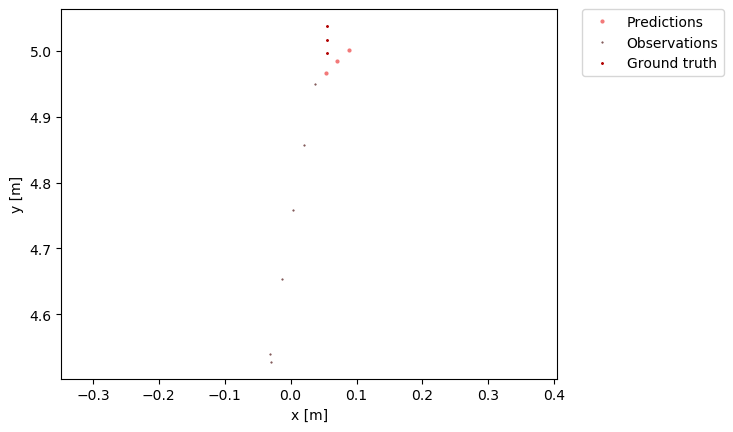
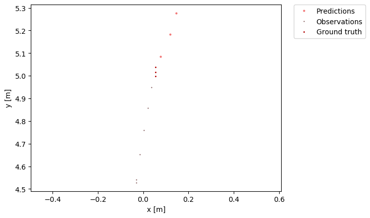
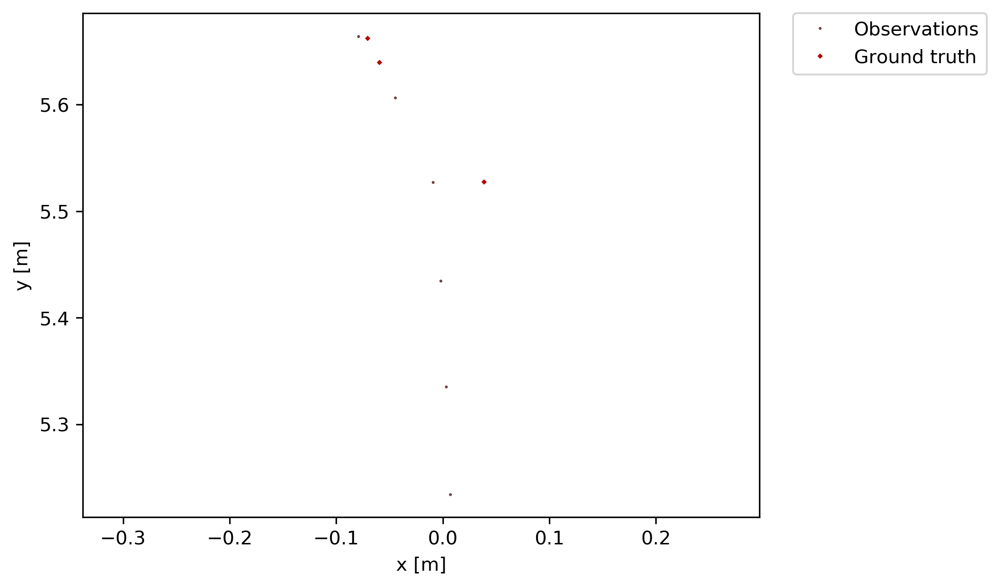

# CrashPredictionExtension

This repository is based on the crash prediction pipeline and data from the following repository: https://github.com/Ludivine388/Crash-Prediction. The scenarios involve a pedestrian crossing the street while a bike with an onboard unit is approaching. The scene is filmed from a third-person view from the side of the street. The onboard unit is collecting V2X data from the bike. The data is brought into a format readable by the Atlas-Benchmark (https://github.com/boschresearch/the-atlas-benchmark) and then evaluated using the included framework.

## Pipeline and Data Format

The crash prediction pipeline processes video frames to generate standardized pedestrian trajectory data. All the referenced files are from the `Trajectory Prediction` folder of https://github.com/Ludivine388/Crash-Prediction. Note that the repo also consists of the files to get the pictures from the .rosbag files. The steps are as follows:

### 1. Initial Data

-   **Input:** A folder containing image frames (e.g., `Trajectory Prediction/test_data/2024-08-22-15-35-05_folder/`).
-   The pipeline starts with a sequence of images (frames) extracted from a video recording, stored in a dedicated folder.

### 2. Depth Analysis

-   **Component:** `Trajectory Prediction/get_depth/get_depth.py`
-   **Method:** Utilizes a pre-trained Pix2Pix model, based on "Learning the Depths of Moving People by Watching Frozen People" for monocular depth estimation.
-   **Output:** For each input image, a corresponding depth image is generated and saved in `Trajectory Prediction/test_data/depthImg/{frame_folder}/`.

### 3. Pose Calculation

-   **Component:** `Trajectory Prediction/get_pose/get_pose.py`
-   **Method:** Uses a pre-trained OpenPose model (`body_pose_model.pth`) for multi-person 2D pose estimation, identifying 18 keypoints per person.
-   **Output:**
    -   Binary pose data files (`.pose`) for each frame in `Trajectory Prediction/test_data/poseData/pose/{frame_folder}/`.
    -   Visualization images with poses drawn, saved in `Trajectory Prediction/test_data/poseData/img/{frame_folder}/`.

### 4. Tensor Generation

-   **Component:** `Trajectory Prediction/get_tensor/generateTensor_Kalman.py`
-   **Method:**
    -   Extracts 2D keypoints from pose data.
    -   Looks up depth values from the depth map.
    -   Applies a Kalman filter to smooth depth estimates.
    -   Projects 2D coordinates and smoothed depth into 3D (X, Y, Z) relative to the camera.
-   **Output:** A single tensor file for all keypoints, saved in `Trajectory Prediction/test_data/InitTensor/Kalman/{frame_folder}/` via `joblib.dump`.

### 5. Relative Displacement Calculation

-   **Component:** `Trajectory Prediction/get_gps_trajectory/get_ped_gps.py`
-   **Method:**
    -   Loads the tensor file.
    -   Uses camera intrinsics to convert coordinates and depth into real-world (X, Y, Z) using `pixel_to_real`.
    -   Calculates the average (X, Y) displacement per pedestrian per frame.
-   **Output:** Dictionary mapping frame numbers to average (X, Y) displacement, saved as `ped_gps_per_frame` in `Trajectory Prediction/test_data/pedestrian_gps/{frame_folder}/`.

### 6. Formatting Coordinates

-   **Component:** `format_coordinates`
-   **Method:**
    -   Iterates through `ped_gps_per_frame` files.
    -   Reads frame ID and (X, Y) coordinates.
    -   Converts each entry into JSON format:
        ```json
        {
          "track": {
            "f": frame_id,
            "p": pedestrian_id,
            "x": x_coord,
            "y": y_coord
          }
        }
        ```
-   **Output:** `_atlas.json` file for each input folder, saved in `Trajectory Prediction/test_data/atlas_json/mmcp/`, with one JSON object per line.

---

## MMCP Dataset and Prediction Models Documentation

### General Model Overview: Which models exist, and how do they work?

Trajectory prediction involves forecasting the future movements of agents (e.g., pedestrians, vehicles) based on their past trajectories and interactions within an environment. For additional information on the different pedestrian trajectory prediction approaches, please refer to the accompanying Excel file: [methods_overview.xlsx](methods_overview.xlsx).

### Dataset Integration with Atlas-Benchmark

A crucial aspect of this project is the **MMCP (Multi-Modal-Crash-Prediction) Dataset**, which contains scenarios designed for crash prediction. The dataset is configured via `dataset_config_mmcp.yaml` to control data loading, preprocessing, and splitting. Key parameters include:
* `frequency: 2.5` Hz: The recording frequency of the data.
* `interpolate: True`: Linearly interpolates missing positions in trajectories.
* `smooth: 5`: Applies a moving average filter with a window size of 5 to reduce noise.
* `observation period: 6`: The number of past time steps (frames) provided as input to the model.
* `prediction horizon: 3`: The number of future time steps (frames) the model is expected to predict.

The Atlas-Benchmark utilizes a "Rolling Prediction" or "Sliding Window" approach to generate individual test scenarios. For each agent's trajectory, a window of size 9 (6 observation + 3 prediction) slides over the data. The first 6 data points serve as the observation, and the subsequent 3 data points act as the Ground Truth (GT) for evaluation. This method mimics real-time prediction and generates a comprehensive set of scenarios for training and evaluation.

---

### Prediction Mode/Setting

The Atlas-Benchmark employs the following metrics and notebook interfaces to use the different models and evaluate the predictions.

**Evaluation Metrics:**
The accuracy of predictions is assessed using standard metrics:

* **ADE (Average Displacement Error)**: The average L2 distance between the entire predicted trajectory and the ground truth trajectory.
* **FDE (Final Displacement Error)**: The L2 distance between the predicted final position and the ground truth final position.
* **kADE / kFDE (Minimum ADE/FDE over k Samples)**: Used for multi-modal predictors that generate *k* possible future trajectories. kADE (minADE) is the ADE of the best-predicted trajectory among *k* samples, and kFDE (minFDE) is the FDE of the best-predicted trajectory among *k* samples.

**Analysis in Notebooks:**

* `understanding_benchmark_experiments.ipynb`: This notebook is used for evaluating and comparing traditional, non-learning-based prediction models. It provides a baseline for performance on the MMCP dataset. Key classes involved are:
    * `Dataset`: Handles loading, preprocessing, and scenario extraction from raw `.json` files.
    * `Predictor_kara` (CVM), `Predictor_sof` (Social Forces), `Predictor_zan`: Encapsulate classic trajectory prediction algorithms.
    * `Benchmark`: Orchestrates the evaluation, iterating through scenarios, calling predictor methods, and computing metrics.
    * `Evaluator`: A utility class for calculating error metrics (ADE, FDE) and visualizing scenarios.

* `understanding_prediction_with_trajectonpp.ipynb`: This notebook focuses on evaluating state-of-the-art, learning-based models, specifically Trajectron++. It allows for a comparison against the simpler baselines. The core class here is `TrajectronPredictor`.

---

### CVM

The **Constant Velocity Model (CVM)** is a fundamental baseline predictor implemented in the `Predictor_kara` class within the `understanding_benchmark_experiments.ipynb` notebook.

**How it works:**
The CVM operates on a simple kinematic principle: it extrapolates an agent's future path by assuming its velocity remains constant based on its last known movement. Given the observation period, the model calculates the average velocity (or simply uses the velocity between the last two observed points) and projects this velocity forward for the prediction horizon.

**Advantages:**
* **Simplicity:** Easy to implement and computationally inexpensive.
* **Baseline:** Provides a basic performance benchmark against which more complex models can be compared.

**Disadvantages:**
* **Lack of Realism:** Fails to account for changes in speed or direction, interactions with other agents, or environmental constraints. It produces linear predictions.
* **Poor Performance in Dynamic Scenarios:** Its accuracy significantly degrades in scenarios involving turns, accelerations/decelerations, or social interactions.

**Reference:** While the CVM is a very basic concept, it is a common baseline in trajectory prediction research. Its principle is often implicitly understood rather than explicitly presented in a dedicated paper. However, it is frequently used as a comparison in papers introducing more complex models.

---

### Trajectron++

**Trajectron++** is a sophisticated, learning-based model for multi-agent trajectory prediction, encapsulated by the `TrajectronPredictor` class in the `understanding_prediction_with_trajectonpp.ipynb` notebook. It represents a significant advancement over classical models by explicitly modeling interactions and inherent uncertainty in future movements.

**How it works:**
Trajectron++ is a pre-trained, **graph-based recurrent neural network (RNN)**.
* **Graph-Based Approach:** The model represents the entire scene as a dynamic graph. Each agent is a node in this graph, and edges are formed based on spatial proximity, allowing the model to explicitly reason about inter-agent relationships and their influence on trajectories. This enables it to capture complex social interactions between multiple agents simultaneously.
* **Multi-Modality:** A key distinguishing feature of Trajectron++ is its ability to generate a **distribution over several possible future trajectories (*k* samples)**, rather than a single deterministic output. This is crucial for capturing the inherent uncertainty in human behavior (e.g., a pedestrian at an intersection could go straight, turn left, or turn right). This multi-modal output provides a more comprehensive understanding of potential future states.
* **Prediction Generation:** Based on observed trajectories and environmental context, Trajectron++ learns to predict the probability distribution of future paths for each agent. The *k* samples are drawn from this learned distribution.

**Evaluation:**
Due to its multi-modal nature, Trajectron++'s performance is not only assessed with ADE/FDE on its most likely prediction but also, and more importantly, with **kADE/kFDE**. These "minimum-over-k" metrics evaluate how well the set of all *k* predictions covers the actual future path, rewarding the model if at least one of its predictions was close to the ground truth. This approach acknowledges the non-deterministic nature of real-world trajectories.

**Reference:**
For a detailed understanding of Trajectron++, its architecture, and experimental results, refer to the original publication:
* **Derek Castro, Kashyap Chitta, and Andreas Geiger.** "Trajectron++: Multi-agent forecasting with human-centric scene representation." *Proceedings of the IEEE/CVF International Conference on Computer Vision (ICCV)*, 2019.

---

## Sample Evaluation of one full test scenario

The following shows the prediction accuracies of the scene `2024-08-22-15-35-33_head_front_camera_color_image_raw_compressed_atlas.json` from the newly collected data. The scene shows the complete test scenario and is therefore a good example of data and prediction quality.

<div style="display: flex; justify-content: center; gap: 20px;">
  <div style="text-align: center;">
    <p><strong>Sample Prediction of the CVM model</strong></p>
    
  </div>
  <div style="text-align: center;">
    <p><strong>Sample Prediction of Trajecton++ model</strong></p>
    
  </div>


</div>

After processing all part-scenario predictions, the overall evaluation of the selected scenario comes to the following results:

| Model         | Mean ADE (± std) | Mean FDE (± std) | Mean kADE (± std) | Mean kFDE (± std) |
|---------------|------------------|------------------|-------------------|-------------------|
| **Trajectron++** | 0.202 ± 0.295    | 0.347 ± 0.473    | 0.202 ± 0.295     | 0.347 ± 0.473     |
| **CVM** | 0.323 ± 0.389    | 0.483 ± 0.570    | 0.323 ± 0.389     | 0.483 ± 0.570     |

Here we can see that Trajectron++, as a learning-based model, outperforms the CVM on this particular scene. This trend persists for the whole dataset; however, there are a few scenes where the CVM performs slightly better than Trajectron++. Note that all experiments so far just include one pedestrian, so models including social aspects to predict the pedestrian's trajectory have no additional power.

---

## Current Problems

### Dataset Availability
To further develop the approach described in this repository, a more extensive dataset would be beneficial. Such a dataset would allow for obtaining test scenes from various angles and provide diverse papers for comparison, enabling a more robust validation of how much V2X integration could enhance crash predictions with pedestrians compared to standard vision-based models. However, most existing datasets lack both an extensive variety of scenes similar to the test scenario in this pipeline and the collection of V2X data from observed vehicles.

Two prominent datasets that have filmed traffic scenes from a comparable third-person view and contain V2X data are:
* TUM-TraffiX dataset: Documented in "TUM-TraffiX: An Urban Dataset for Traffic Scene Analysis and Prediction with V2X Communication" by Renz et al., *IEEE Intelligent Transportation Systems Conference (ITSC)*, 2021.
* V2X-seq-SPD datasets: Described in "V2X-Seq-SPD: A Dataset for V2X Sequence Prediction and Safety Driving" by Wang et al., *International Conference on Robotics and Automation (ICRA)*, 2022.

Despite their strengths, these datasets do not contain scenes where pedestrians cross the street while a car approaches, leading to a potential crash situation. Consequently, we must continue to work with the dataset currently in use.

### Accuracy of Pipeline
Noticeable inconsistencies can be observed in the ground truth data, ranging from varying step-sizes to backward steps and unusual directional patterns (e.g., zig-zag movements). Since this pipeline determines the pedestrian's position based on two computer vision models (a depth model and a pose model), an inherent uncertainty arises from their individual limitations, leading to inconsistencies between frames. An additional contributing factor is the inconsistent framerate of the camera. The `.mp4` videos do not maintain a consistent speed, resulting in a framerate that varies over time or a video speed that fluctuates throughout the scene. The following picture illustrates this for a 6-point observation period and a 3-point prediction horizon:



---

## Possible Extensions
